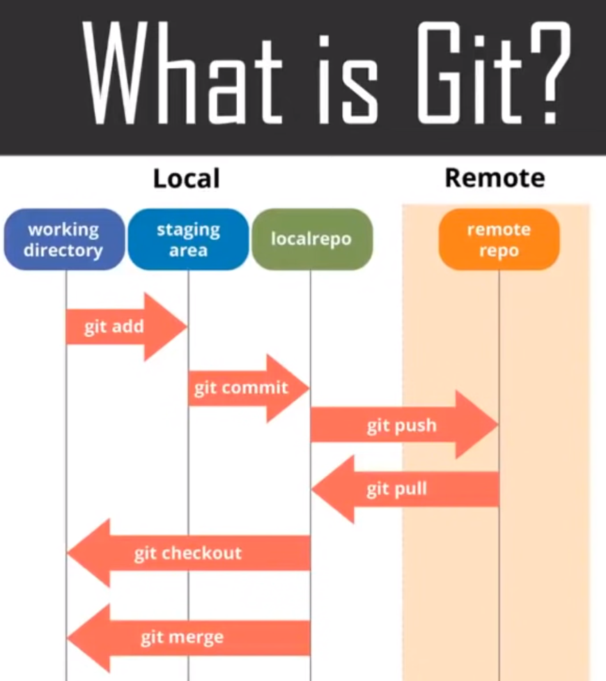

# Resources
[Resource1](https://youtu.be/GzIFoJBVwh8?t=4261)

# Git commands
## Configure basic info about you with git config
```
git config -global user.name <your-name>

git config -global user.email <your-email-address>
```
## Git initiate
```
git init <directory-name> # Empty directory name is the current directory

git clone <git-repo-url>

git remote add <variable_name> <remote_server_link> # Connect from your local repo to the remote server

```

# Working Directory to Staging Area
```
git add <./file-name> # Add to the staging area


git rm <file-name> # This command deletes your file from the working directory and stages 
```

# Git branches
```
git branch <branch_name> # Create a new branch name

git branch # Show all branches

git branch -d <branch_name> # Delete a new branch name

git checkout <branch_name> # Switch to another branch

git checkout -b <branch_name> # Create a new branch and switch to it
```

# Git History
```
git log --oneline # Gets all commits' IDs and messages

git show <commit-id> # Shows the metadata and the commit changes of the specified commits
```

# Staging Area to LocalRepo
```
git commit -m "Your message" # Commit any files you've added with the git add command
```

# Git merge & rebase
```
git merge <another_branch> # Merge another_branch to the current branch

git rebase <another_branch> # Rebase another_branch to the current branch
```

# LocalRepo to and from remote repo
```
git push -u <variable_name> <remote_server_link>:branch_name

git pull <remote_server_link>
```