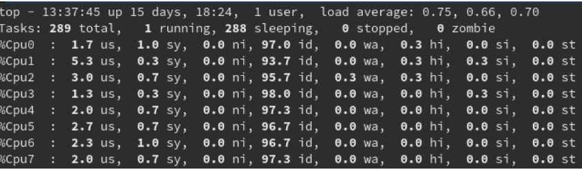

# Resource list
[Resource1](https://youtu.be/GzIFoJBVwh8)

[Resource2](https://www.opstrainerz.com/blog/linux-commands-for-devops)

[Resource3](https://www.redhat.com/sysadmin/troubleshooting-system-performance)

For more resources press [here](https://docs.google.com/spreadsheets/d/1P7U6IOTo2cTElbN8B7llTIu5uA4klXbcMokvnXKrzJ8/edit?usp=sharing)

# Command-line interface
```
man <command>       # manual (use -k or apropos)
whereis <command>
whereiswhatis <command>
whoami                 # Who is the user
```            

# Navigation and basic files' management
```
cp <source_file> <source_file>  # Copy commands
ls                              # List
mv <source_file> <source_file>  # Move commands
rm <file_name>                  # remove (-r for directory)
rmdir <empty_directory_name>    # remove empty directory
cd	                            # Change the current directory (folder)
ls	                            # List files in a directory
# dd Convert and copy files. if = Import files. of = Output file
dd if = /dev/hda of = /dev/hdb
```

# Manioulating data in files
```
cat
grep        # -i Return insensitive results, -v Return not matching, -n Return match work along with its line number , -c Return the number of lines in which results match

sort        # -r Return the reverse order, -f Return case-sensitive order (Uppercase and Lowercase words), -n Return the result as per the numerical order

cut -c<num_of_start_char> <num_of_end_char> filename    # Cut only particular characters

sed  's/current_wod/replaced_word/' filename            # Use this command to replace a text in a file by searching it in a file

awk '/word_in_line/ {print}' awktest.txt                # Print every line that has the word
awk '{print $1}' awktest.txt                            # Print the first word

uniq filename       # To remove all the duplicate lines

cat file.txt | tr "[a-z]" "[A-Z]"                       # Translate to uppercase words

```
# List of open files
```
lsof        # -u For a particular user
```

# Args as a shell
```
eval args               # Execute areguments as a shell command
```

# Archiving
```
tar -cvf  filename source_folder    # Zip a folder
tar -xvf tar_filename               # UnZip a tar file
```

# Permissions
```
chown       # Change owner for a file
chmod       # Change permissions for a file. 1 - Execute, 2 - Write, 3 - Execute and write, 4 - Read
```

# User and group management
```
su                  # Switch user
useradd             # Add a user
userdel             # Delete a user
groupadd            # Add a group
groupdel            # Delete a group

id  <flag> username # -u prints only the effective user ID, -G prints all the group IDs, -n prints names instead of numbers, -r prints read IDs instead of numbers, -help displays the help messages ID, -version
```

# Environment Variables
```
env / printenv  # List all the environments 
env -i command  # Run a command with an empty environment
env -u variable # Remove a variable from the environment
```


# Resource usage
```
free   # Check for memory usage. -b displays the memory in bytes. -k for Kilobyte. -m for megabyte. -g for Gigabyte

df     # Reports the amount of available disk space being useed by the file systems
sudo df -h

du     # Report the size of directory trees inclusive of all their contencts and the size of individual files 
sudo du -h -d 1 /var/

```

# Processes
```

```

# Package management
```
apt-get     # CLI which helps handling packages in Linux debian distribution

yum     # CLI which helps handling packages in Linux RHEL distribution
```

# SSH for secure way to remote other machines
```
ssh-keygen -t rsa                   # Generates RSA key
```

# Firewall
```

```

# Network configuration
```
ifconfig -a     # Display all the interfaces. -s displays a short version of your interfaces

ip address      # Show all the ip addresses assosiated on all network devices

ip link         # Displays link layer information

netstat  -at    # network layer information. -at shows all of the tcp ports that are available

nslookup        # Getting information from the DNS server

curl            # Transfer data to/from a server

```

# System logs


# Watching in interactive mode logs
```
watch flag command      # -d Highlights the differences between the successive upadtes

tail -f filename
```

# Best Practice Tips
## [Documentation](https://www.redhat.com/sysadmin/poor-documentation)
```
Always document changes. Changes include software patches, updates of any kind, hardware replacements or upgrades, driver updates, firmware updates, code pushes, new software installs, and configuration changes.

your forensic investigation should contain the symptoms, deduction, and reasoning that led to your diagnosis along with the steps you took to solve the issue, the people that were involved, etc.
```
## Updating
```
There's always something that needs to be updated on a system: BIOS, firmware, drivers, the operating system, applications, agents, security software, databases, backup software, and so on.

Decide how often you need to update, or comply with your organization's patching policy to plan, schedule, and apply those updates.
```

## Rebooing
```
Reboot at least once a month. 

Reboot solves a lot of problems and helps you diagnose hardware problems with minimal effort. Powering off the system occasionally is also good practice, because bringing a system up from a cold boot can identify a lot of hardware problems that might hide on a running system.
```


# [Troubleshooting](https://www.redhat.com/sysadmin/troubleshooting-slow-servers)
## Initial login
```
The ssh command has three debug levels, each of which gives you a plethora of information before you’re even on the system. To enable debug, just add an additional v to the -v option.
[~]$ ssh -vvv hostname.domain.com
```

## CPU troubleshooting
### Checking CPU usage with top
```
The top utility gives you a real-time look at what’s going on with the server. By default, when top starts, it shows activity for all CPUs.

This view can be changed by pressing the numeric 1 key, which adds more detail regarding the usage values for each CPU.
```


For more info about top click [here](https://www.site24x7.com/learn/linux/top-command.html).

## Memory
```
If you find that during the course of a day your system's memory is drained off, the first thing to check is your logging.

You should also look at swap space if you suspect a memory problem. In this output, my system is idle so the result isn't dramatic. Use the free -m command to check physical and virtual (swap) memory usage

```
For more info about RAM press [here](https://www.redhat.com/sysadmin/cloud-swap.


 